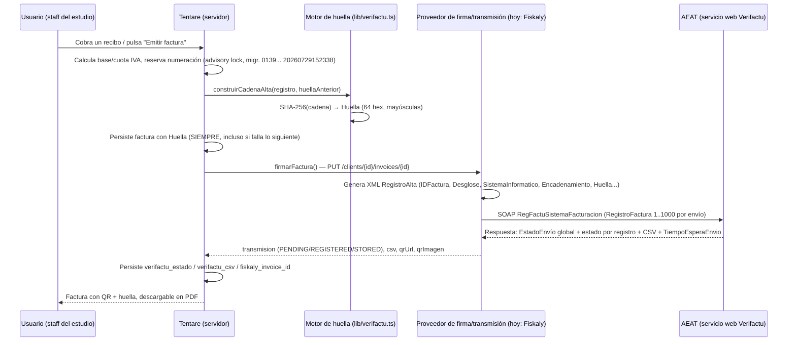

# Verifactu — investigación técnica exhaustiva y decisión build-vs-buy

> Documento de investigación, sin implementación. Fuentes primarias descargadas y parseadas directamente de `sede.agenciatributaria.gob.es` / `agenciatributaria.es` (PDFs oficiales, XSD, WSDL, catálogo de errores en vivo) — no blogs, salvo que se marque explícitamente lo contrario. Todas las fuentes consultadas el 29-jul-2026. Complementa a [docs/ARQUITECTURA-LEGAL-PAGOS-FACTURACION.md](ARQUITECTURA-LEGAL-PAGOS-FACTURACION.md) (§3 Verifactu), que cubría el estado del código; este documento profundiza en el estándar técnico de la AEAT en sí y en la decisión de construirlo nosotros vs. seguir con un proveedor.
>
> ⚠️ **Aviso de alcance en las partes jurídicas (§3.1, §15 y toda referencia a eIDAS/custodia de certificados/control exclusivo):** esas conclusiones son un análisis técnico razonado a partir de fuentes oficiales dispersas (FAQ AEAT, catálogo de errores, comparación con TicketBAI/Izenpe) y de un ejemplo de mercado (FacturaDirecta) — **no son un dictamen legal, ni doctrina administrativa asentada, ni jurisprudencia**. Ninguna fuente oficial de la AEAT confirma ni descarta expresamente el Modelo B. Antes de tratar cualquiera de esas afirmaciones como una conclusión definitiva sobre la que construir producto, hace falta validarlas con un especialista (abogado fiscal/mercantil o un criterio directo de la AEAT vía `comunicacion.sepri@correo.aeat.es`). Esta prudencia aplica a todo el documento, no solo a las secciones donde se repite explícitamente.

## Resumen ejecutivo (léelo si solo lees una sección)

Verifactu **no es "un XML y un hash"** — es un ecosistema con tres piezas separadas y de dificultad muy distinta:

1. **El núcleo técnico** (XSD, hash chain, QR): documentado con precisión milimétrica por la AEAT, estable desde hace casi 2 años, y **Tentare ya lo tiene construido y probado contra los vectores oficiales**. Esta pieza, hacerla nosotros mismos, es barata y ya está pagada.
2. **El canal de transmisión SOAP** (WSDL, reintentos, control de flujo, catálogo de errores): es ingeniería normal de nivel medio-alto, pero manejable — no es el obstáculo real.
3. **La legitimación para transmitir en nombre de terceros**: aquí hay **tres modelos distintos**, no dos (ver §3.1 y §15 para el análisis completo):
   - **Modelo A — certificado propio de Tentare, actuando como colaborador social/apoderado**: exige convenio tipo 017 + representación formal (firma+DNI o firma electrónica avanzada) de cada estudio. Es lo que resuelve Fiskaly hoy.
   - **Modelo B — cada estudio sube su propio certificado, Tentare lo custodia y firma con él**: evita el convenio de colaborador social específico (verificado contra un proveedor real del mercado, FacturaDirecta, que ofrece esta ruta afirmando explícitamente "no se requiere apoderamiento"), pero **no elimina la necesidad de legitimación — la desplaza** a un mandato civil claro + el riesgo de custodiar una clave privada de un certificado cualificado sin ser un prestador de servicios de confianza reconocido (ver §3.1, es zona gris no resuelta por ninguna fuente oficial de la AEAT).
   - **Modelo C — proveedor externo (Fiskaly u otro)**: el proveedor ya asumió el Modelo A por su cuenta.

**Recomendación adelantada** (desarrollada en detalle en §15): no migrar a integración directa ahora, ni en su forma A ni en su forma B. El Modelo B es una alternativa real y usada en el mercado, pero introduce una zona gris legal propia (custodia de certificado, control exclusivo bajo eIDAS) que ningún texto oficial de la AEAT confirma ni descarta — no es una vía "sin problemas legales", es un problema legal *distinto* y sin resolver en jurisprudencia todavía. Con el volumen actual de Tentare (11 estudios, 0 suscripciones de pago), ninguna de las dos rutas de integración directa compensa frente a seguir con un proveedor.

---

## 1. Arquitectura oficial — flujo completo con diagrama

### Flujo real, de "Emitir factura" a la respuesta de la AEAT



### Puntos clave del flujo verificados contra el WSDL/PDF oficial

- El **WSDL único** (mismo esquema para remisión voluntaria y remisión bajo requerimiento) define exactamente **dos operaciones**: `RegFactuSistemaFacturacion` (alta y anulación, mismo mensaje) y `ConsultaFactuSistemaFacturacion` (**solo disponible en modo voluntario**, con paginación de hasta 10.000 registros).
- Hay **endpoints distintos** según modalidad y tipo de certificado:

| Entorno | Modalidad | Endpoint |
|---|---|---|
| Producción | Voluntaria (VERI\*FACTU), cert. persona/representante | `www1.agenciatributaria.gob.es/wlpl/TIKE-CONT/ws/SistemaFacturacion/VerifactuSOAP` |
| Producción | Voluntaria, **cert. de sello** (caso SaaS) | `www10.agenciatributaria.gob.es/wlpl/TIKE-CONT/ws/SistemaFacturacion/VerifactuSOAP` |
| Pruebas | equivalentes | mismos paths sobre `prewww1.aeat.es` / `prewww10.aeat.es` |

La propia AEAT advierte que, aunque el XSD es común, **cada URL puede tener matices distintos de validación de negocio** — voluntaria y requerimiento son sistemas de gestión separados en la AEAT, sin compartir registros entre sí.

- **La respuesta no es un único código**: hay un estado global del envío (`Correcto`/`ParcialmenteCorrecto`/`Incorrecto`) y un estado por cada registro dentro del envío (`Correcto`/`AceptadoConErrores`/`Incorrecto`) — un envío de 500 facturas puede tener 490 aceptadas y 10 rechazadas, y hay que procesar esa granularidad.
- **El CSV (Código Seguro de Verificación) de la remisión NO es recuperable después** — la AEAT lo dice literalmente: si no se persiste en el momento del alta, se pierde para siempre. Esto ya está cubierto en el código actual (`facturas.verifactu_csv`), pero es una restricción de diseño crítica a tener siempre presente en cualquier evolución futura.
- **Control de flujo obligatorio**: la AEAT devuelve `TiempoEsperaEnvio` (arranca en 60 s, recalculable) que hay que respetar antes del siguiente envío — no se puede simplemente lanzar envíos en bucle.

---

## 2. Requisitos técnicos — lista completa

| Pieza | Qué es | Estado en Tentare |
|---|---|---|
| XSD oficiales | `SuministroInformacion.xsd` + `SuministroLR.xsd` — estructura completa del registro de facturación | No se consumen directamente (Fiskaly abstrae el XML) |
| WSDL | Contrato SOAP con las 2 operaciones | No implementado (Fiskaly lo hace) |
| SOAP 1.1 | Protocolo de transporte, estilo `document`/`literal`, máx. 1.000 registros/envío | No implementado directamente |
| Certificado cualificado | Persona física / representante / **sello de entidad** / colaborador social | Gestionado por Fiskaly (MANAGED) |
| Hash SHA-256 encadenado | Huella de cada registro, encadenada con la anterior | ✅ Implementado y validado contra vectores oficiales |
| QR | URL de cotejo AEAT + maquetación física normativa | ✅ Implementado (formato) + generado realmente por Fiskaly |
| Encadenamiento | Cadena única por (obligado emisor + Sistema Informático), altas y anulaciones mezcladas | ✅ Correcto en el diseño actual (una cadena por estudio) |
| Firma XML-DSig | Solo relevante para modalidad NO-Verifactu (conservación local) | No aplica — Tentare opera en modo Verifactu puro |
| Auditoría/trazabilidad | Registro de qué se envió y cuándo, con reintentos | Parcial — cubierto por columnas `verifactu_*`, sin cola de reintentos propia |
| Reintentos | Ante fallo de red o `TiempoEsperaEnvio` | Delegado a Fiskaly; Tentare tiene fallback "huella propia sin transmisión" si Fiskaly falla |
| Sandbox | Entorno de pruebas AEAT (`prewww1`/`prewww10`/`prewww2`) | Fiskaly tiene su propio entorno `test.es.sign.fiskaly.com` (no transmite a la AEAT real) |
| Producción | Entorno real | Fiskaly `live.es.sign.fiskaly.com`, condicionado a credenciales `FISKALY_API_KEY`/`SECRET` en Vercel (pendiente confirmar) |
| Declaración responsable del SIF | Autocertificación del productor de software (no de cada estudio) | No verificado si Tentare/Fiskaly la tienen suscrita — pendiente de confirmar |
| Colaborador social (convenio 017) | Necesario para transmitir en nombre de terceros con certificado propio | No lo tiene Tentare — lo tiene Fiskaly |

---

## 3. Certificados — análisis profundo

### Qué certificados existen y para qué

- **Persona física**: el propio obligado tributario transmite sus propias facturas.
- **Representante** (administrador de una SL, apoderado): actúa en nombre de la empresa que representa.
- **Sello electrónico de entidad**: pensado para transmisión **automatizada por sistemas de terceros** — es el que corresponde al caso "SaaS emite en nombre de sus clientes", y de ahí el endpoint específico `www10`/`prewww10` ("Web Services para Contribuyentes con certificado de sello").
- **Colaborador social** (convenio tipo 017): certificado propio de un tercero (asesoría, o proveedor de software como Fiskaly) que le permite transmitir en nombre de **múltiples** obligados tributarios representados, sin que cada uno tenga que dar su propio certificado.

La AEAT lo confirma explícitamente en el catálogo de errores (código `4112`): *"El titular del certificado debe ser Obligado Emisión, Colaborador Social, Apoderado o Sucesor."*

### Formato de fichero

⚠️ **No especificado por la AEAT en la documentación revisada.** Es razonable asumir PKCS#12 (`.p12`/`.pfx`, estándar X.509 para los certificados FNMT/eIDAS), pero no hay una página oficial que lo diga literalmente — no lo presentes como hecho confirmado sin volver a verificarlo.

### ¿Cada estudio necesita el suyo? — corrección tras verificación adicional (3 modelos)

La primera pasada de esta investigación decía que el modelo "cada estudio con su propio certificado" era "pésimo para un SaaS" e "incompatible con la automatización". **Eso era incorrecto — verificado y corregido**: no rompe la automatización (Tentare puede seguir usando el certificado programáticamente, sin intervención manual del estudio en cada envío), y es un modelo real y activo en el mercado español de facturación electrónica. Hay tres modelos, no dos:

| | Modelo A — certificado de Tentare (colaborador social/apoderado) | Modelo B — certificado propio del estudio, custodiado por Tentare | Modelo C — proveedor externo |
|---|---|---|---|
| Quién firma ante la AEAT | Tentare (como colaborador social/apoderado) | El propio estudio (con su identidad) | El proveedor (asume el Modelo A) |
| ¿Necesita convenio tipo 017? | Sí | **No** (verificado contra un proveedor real de mercado, ver abajo) | El proveedor ya lo tiene |
| ¿Necesita representación formal AEAT (firma+DNI)? | Sí, de cada estudio | No como trámite tributario — pero sí un mandato civil/contractual claro (ver riesgo abajo) | No aplica a Tentare |
| Riesgo principal | Carga administrativa recurrente con la AEAT | Custodia de clave privada de un certificado ajeno — zona gris legal no resuelta (ver abajo) | Dependencia del proveedor |
| ¿Quién lo usa hoy? | — | FacturaDirecta (una de sus dos rutas) | Tentare hoy, vía Fiskaly |

**Verificación del Modelo B**: un proveedor real del mercado (FacturaDirecta) ofrece exactamente esta ruta — subir tu propio certificado (.p12/.pfx) — y su propia documentación de ayuda dice literalmente que en ese caso **"no se requiere apoderamiento"**. Esto confirma que la distinción de la AEAT (error `4112`: "el titular del certificado debe ser Obligado Emisión, Colaborador Social, Apoderado o Sucesor") mira **el certificado en sí**, no quién opera el software que hace la llamada — si el certificado es del propio estudio, el estudio ya es "Obligado Emisión" y no hace falta ninguna figura adicional frente a la AEAT.

**Pero el Modelo B no está exento de riesgo legal — solo tiene uno distinto, no resuelto**:
- No hay ninguna norma de la AEAT (ni el RD 1007/2023, ni la Orden HAC/1177/2024, ni las FAQ) que regule explícitamente "un proveedor de software custodia y usa el certificado de su cliente" — es una zona gris construida por inferencia, no una figura reconocida con nombre propio.
- El paralelismo con **TicketBAI es una señal de alerta concreta, no solo teórica**: Izenpe (el organismo emisor de certificados TicketBAI) advierte explícitamente en su propia FAQ que **no se debe entregar un certificado de representante de entidad a un desarrollador de software, salvo que ese desarrollador sea una empresa que preste servicios de confianza de custodia de certificados** — un estándar de cumplimiento (auditoría, HSM certificado, ENS/eIDAS) bastante más exigente que "guardar un .pfx cifrado en un servidor".
- Para certificados **cualificados** bajo eIDAS, el requisito legal de "control exclusivo del firmante" sobre los datos de creación de firma (art. 26 eIDAS) es normativo, no solo buena práctica — si Tentare (no siendo un prestador de servicios de confianza reconocido) tiene la clave privada del estudio, existe un argumento jurídico real de que la firma pierde su presunción de validez cualificada, y de que Tentare asume un riesgo de facto similar al de actuar como intermediario no autorizado, aunque formalmente no lo sea ante la AEAT.
- Ninguna fuente oficial confirma ni descarta este modelo — antes de construir nada sobre este supuesto, la recomendación es una consulta directa a la AEAT (`comunicacion.sepri@correo.aeat.es`) planteando el escenario exacto.

### ¿Puede Tentare actuar como representante?

Sí (Modelo A) — es exactamente el mecanismo que existe para esto (representación/apoderamiento/colaboración social), con la carga ya descrita (representación formal por cada estudio + convenio con Hacienda). Es lo que **Fiskaly ya tiene resuelto**.

### Cómo se almacenan y se usan para firmar

Con el modelo actual (Fiskaly `MANAGED`, Modelo C), Tentare **no almacena ningún certificado** — Fiskaly asigna y custodia el certificado de firma internamente; Tentare solo persiste ids de referencia (`signerId`, `clientId`) por estudio. Si se integrase directamente:
- **Modelo A**: un único certificado de sello propio de Tentare + convenio de colaborador social.
- **Modelo B**: un certificado por estudio, subido por el estudio y custodiado por Tentare — viable y sin necesidad de convenio 017, pero con el riesgo de custodia/eIDAS descrito arriba, que exigiría como mínimo cifrado en reposo con clave separada, control de acceso auditado, y probablemente asesoría legal específica sobre si Tentare necesita constituirse como prestador de servicios de confianza para hacerlo con seguridad jurídica plena.

### Coste real (fuente oficial FNMT, precios publicados)

| Certificado | Precio |
|---|---|
| Representante — administrador único/solidario | 24 € + IVA |
| Representante — persona jurídica | 14 € + IVA |
| Representante — entidad sin personalidad jurídica | 0 € |
| Persona física (videoidentificación) | 2,99 € + impuestos |
| Sello de entidad | No publicado en la página revisada — consultar directamente a FNMT |

El coste del certificado en sí es bajo. **El coste real no es el certificado — es el convenio de colaborador social y la gestión de representaciones formales de cada cliente**, que no tiene un precio de tarifa público (es un trámite administrativo con la AEAT, no una compra).

---

## 4. Comunicación con la AEAT

### SOAP en detalle

SOAP 1.1, estilo `document`, `use="literal"` (sin encoding RPC), UTF-8, HTTPS, máximo 1.000 registros de facturación por envío SOAP (`RegistroFactura maxOccurs="1000"`). Un mismo envío puede mezclar altas y anulaciones de distintas facturas.

### Qué devuelve la AEAT

- **Envío correcto**: estado global + estado por registro + CSV de la remisión (no recuperable después, debe persistirse en el acto) + `TiempoEsperaEnvio`.
- **Error estructural/de cabecera** → rechazo completo vía `SoapFault` (ejemplo real: NIF de cabecera no identificado).
- **Error de negocio a nivel de registro individual** → no es un Fault, es una respuesta XML normal con `CodigoErrorRegistro`/`DescripcionErrorRegistro` por registro — el resto del envío se sigue procesando.

### Catálogo de errores (publicado, y "vivo")

La AEAT publica un recurso real en runtime (`errores.properties`, el mismo que usa su propio motor de validación) con tres bloques:
- **Rechazo de envío completo**: 4100-4141 (NIF no identificado, error obteniendo certificado, titular de certificado no autorizado, acceso Verifactu suspendido...).
- **Rechazo de registro**: 1100-1293 y 3000-3004 (duplicados, factura dada de baja, sin permisos...).
- **"Aceptado con errores"** (no rechaza, solo marca): 2000-2008 — incluye `2000` (huella incorrecta) y `2007` (primer registro incorrecto cuando ya existen facturas previas del mismo emisor+sistema).

Este catálogo se sirve como fichero de configuración dinámico, no como documento versionado de una vez — cambia con más frecuencia que el resto del sistema (ver §11), así que cualquier integración directa debería tratarlo como una tabla a re-sincronizar, no como una constante fija en el código.

### Gestión de reintentos

- Respetar `TiempoEsperaEnvio` antes del siguiente envío (empieza en 60 s, la AEAT lo recalcula).
- Ante fallo de red/timeout: reintentar con backoff, pero **nunca reenviar el mismo registro con una huella distinta** — si ya se persistió una huella localmente, el reintento debe transmitir exactamente ese registro, no recalcularlo (evita romper la cadena).
- El diseño actual de Tentare ya sigue el principio correcto aquí: la huella se calcula y persiste ANTES de intentar transmitir, así que un fallo de transmisión nunca genera una huella distinta en un reintento posterior.

---

## 5. XML Verifactu

### Generación y estructura

El sobre SOAP contiene `Cabecera` (`ObligadoEmision`, `Representante` opcional, y `RemisionVoluntaria` o `RemisionRequerimiento`) + de 1 a 1.000 `RegistroFactura`.

### Campos obligatorios de un `RegistroAlta` (lista completa verificada contra el XSD)

Más allá de los ya conocidos (`IDFactura`, `TipoFactura`, `CuotaTotal`, `ImporteTotal`, `Huella`, `FechaHoraHusoGenRegistro`): `NombreRazonEmisor`, `DescripcionOperacion`, `Desglose` (1-12 líneas de IVA), `Encadenamiento` (choice `PrimerRegistro`/`RegistroAnterior`), `SistemaInformatico` (identificación completa del software — ver abajo), `TipoHuella`. Opcionales relevantes: `TipoRectificativa`+`FacturasRectificadas` (solo si R1-R5), `FacturasSustituidas` (solo F3), `Macrodato` (obligatorio si el importe ≥ 100M€), `Destinatarios`, `Cupon`.

### `SistemaInformatico` — identificación obligatoria del software

```
NombreRazon + NIF          ← del PRODUCTOR del software (Fiskaly, o Tentare si se integrase directo)
NombreSistemaInformatico   ← nombre comercial
IdSistemaInformatico       ← 2 caracteres alfanuméricos
Version                    ← texto libre
NumeroInstalacion          ← identificador de instalación concreta
TipoUsoPosibleSoloVerifactu / TipoUsoPosibleMultiOT / IndicadorMultiplesOT  ← S/N
```

Esto importa porque **el ámbito de la cadena de hash es (obligado emisor + Sistema Informático)** — ver §6. Si Tentare cambiase de proveedor de firma en el futuro, cambiaría de `IdSistemaInformatico`/`NumeroInstalacion`, lo que técnicamente inicia una nueva cadena para ese estudio (el error admisible `2007` existe precisamente para ese escenario).

### Validación del XML

Contra los XSD oficiales (`SuministroInformacion.xsd`/`SuministroLR.xsd`) antes de enviar; la AEAT valida además reglas de negocio no expresables en XSD puro (ver catálogo de errores 1100-1293), así que la validación de esquema por sí sola no garantiza aceptación.

---

## 6. Hash — confirmación exhaustiva

### Orden exacto de concatenación

**Alta**: `IDEmisorFactura & NumSerieFactura & FechaExpedicionFactura & TipoFactura & CuotaTotal & ImporteTotal & Huella(anterior) & FechaHoraHusoGenRegistro` — formato query-string literal (`campo=valor&campo=valor`), sin URL-encoding, SHA-256, hex en **mayúsculas**. Esto coincide exactamente con lo que Tentare ya implementa en `lib/verifactu.ts`.

**Anulación**: mismo patrón, con los campos `...FacturaAnulada`.

### Matices confirmados que refuerzan el diseño actual

1. **El primer registro de la cadena SÍ incluye el campo `Huella=` vacío en la cadena a hashear** (no se omite) — lo que marca que es el primero es el campo `PrimerRegistro` dentro de `Encadenamiento`, no la ausencia del campo. Vector de prueba oficial verificado: cadena `IDEmisorFactura=89890001K&NumSerieFactura=12345678/G33&FechaExpedicionFactura=01-01-2024&TipoFactura=F1&CuotaTotal=12.35&ImporteTotal=123.45&Huella=&FechaHoraHusoGenRegistro=2024-01-01T19:20:30+01:00` → hash esperado `3C464DAF61ACB827C65FDA19F352A4E3BDC2C640E9E9FC4CC058073F38F12F60`. **Recomendación: añadir este vector exacto al test suite** si no coincide ya con el que se usa hoy.
2. **Altas y anulaciones comparten una única cadena secuencial** por (obligado emisor + Sistema Informático) — una anulación se encadena contra el último registro (alta o anulación) anterior, no en una cadena separada.
3. **El ámbito del encadenamiento es (NIF emisor + Sistema Informático), NO por serie de factura.** Si un estudio tiene varias series, todas comparten la misma cadena.
4. **Normalización numérica**: `123.1` y `123.10` deben producir el mismo hash (ceros a la derecha normalizados antes de concatenar).
5. **Si el hash no coincide en la validación de la AEAT, no se rechaza el registro** — se marca "Aceptado con errores" (código `2000`). Importante para el diseño de monitorización: un fallo de huella no bloquea la factura, pero sí debería generar una alerta.
6. **El algoritmo (SHA-256) lleva congelado casi 2 años** (última revisión del documento de hash: ago-2024) — es la pieza más estable de todo el sistema.

---

## 7. QR

### Gramática exacta

`https://www2.agenciatributaria.gob.es/wlpl/TIKE-CONT/ValidarQR?nif=...&numserie=...&fecha=DD-MM-AAAA&importe=...` (o el equivalente `prewww2` en pruebas; `ValidarQRNoVerifactu` para sistemas no-Verifactu). Parámetros obligatorios: `nif` (9), `numserie` (máx. 60, URL-encoded), `fecha` (`DD-MM-AAAA`), `importe` (máx. 12+2 decimales, `.` como separador). Opcional: `idioma` (gl/ca/eu/es/va/en, novedad de dic-2025).

### Especificación física normativa (art. 21 Orden HAC/1177/2024)

Tamaño 30x30 a 40x40 mm, ISO/IEC 18004:2015, nivel de corrección M, margen ≥2mm (recomendado 6mm), al principio de la factura, precedido por el texto **"QR tributario:"**, y en sistemas Verifactu debajo debe ir "Factura verificable en la sede electrónica de la AEAT" o "VERI\*FACTU".

### Qué contiene y qué valida

El QR no contiene la huella ni datos fiscales completos — solo los 4 campos que permiten a la AEAT (o al propio destinatario) cotejar contra su copia registrada de esa factura. Respuesta del servicio de cotejo: `00` encontrada, `01` no encontrada/anulada, `02` no contrastable (sistemas no-Verifactu).

---

## 8. Facturas — todos los tipos

| Tipo | Código | Uso |
|---|---|---|
| Completa | `F1` | Factura habitual, con NIF de receptor |
| Simplificada | `F2` | Ticket, sin NIF de receptor |
| Sustitutiva | `F3` | Sustituye facturas simplificadas previas (`FacturasSustituidas`) |
| Rectificativa | `R1`-`R4` | Distintos motivos legales (error de derecho, art. 80 LIVA, concurso, incobrables — desglose exacto no verificado línea a línea contra la Ley de Facturación en esta pasada) |
| Rectificativa simplificada | `R5` | Rectificativa de una `F2` |

**No existe `F4`** (a diferencia del SII, que sí lo tiene en algunos casos) — no asumas paridad completa con SII si en algún momento se compara.

### Cómo se referencia la factura original

- `TipoRectificativa`: `S` (sustitución) o `I` (por diferencia/incremento) — obligatorio si y solo si el tipo es R1-R5.
- `FacturasRectificadas`: lista de hasta 1000 referencias (mismo triple ID que cualquier factura) — opcional incluso en una rectificativa.
- `ImporteRectificacion` (`BaseRectificada`/`CuotaRectificada`/`CuotaRecargoRectificado`): obligatorio si y solo si `TipoRectificativa=S`.

### Estado actual en Tentare (recordatorio de §2/§3 del documento maestro)

La función pura de cálculo de huella de anulación (`calcularHuellaAnulacion`) existe y está probada en `lib/verifactu.ts`, pero no tiene ningún llamador en producción — no hay tabla, endpoint ni UI de rectificativas/notas de crédito todavía. Es el hueco más directamente relacionado con esta sección.

---

## 9. Sandbox

Hay que distinguir dos portales de pruebas de la AEAT, que se suelen confundir:

1. **`preportal.aeat.es`**: portal genérico de pruebas de TODA la AEAT (no específico de Verifactu), acceso libre con solo autenticarse vía certificado electrónico — datos guardados en una BD de pruebas "sin trascendencia tributaria". Confirma los 3 subdominios de prueba: `prewww1`, `prewww2`, `prewww10`.
2. **El WSDL/XSD específico de Verifactu en pruebas**: mismo esquema, distinta URL (`prewww1.aeat.es`/`prewww10.aeat.es`).

**No se documenta un certificado de pruebas separado** — la interpretación razonable (no confirmada de forma explícita) es que se usa el mismo certificado cualificado real, solo apuntando a otro endpoint.

**El paso de pruebas a producción no tiene un trámite formal documentado en las páginas oficiales revisadas** — lo único que cambia es el endpoint. Existe un código de error (`4139`, "Servicio no habilitado en producción") que sugiere algún control de activación por sistema/NIF, pero el mecanismo exacto no está claro en la documentación pública — zona gris a confirmar con la AEAT directamente (`verifactu@correo.aeat.es`) si algún día se decide integrar directamente.

---

## 10. Producción

Pasos identificables desde la documentación oficial (con la zona gris ya señalada en §9):
1. Certificado cualificado válido para el tipo de titular correspondiente (sello de entidad + colaborador social, en el caso "SaaS transmite por terceros").
2. Declaración responsable del SIF suscrita por el productor del software.
3. Apuntar el cliente SOAP al endpoint de producción (`www1`/`www10`) en vez de pruebas.
4. (Zona gris) Posible activación/habilitación del servicio en producción por sistema/NIF — mecanismo no documentado con precisión.

---

## 11. Cambios futuros — cadencia real y cómo diseñar para absorberlos

Compilado de las tablas de revisión de los 4 documentos técnicos oficiales:

| Documento | Cadencia real 2023-2026 |
|---|---|
| Descripción Servicio Web (SOAP/WSDL) | Estabilizado desde feb-2025; solo una errata desde entonces |
| **Validaciones y Errores** (catálogo de reglas/códigos) | **La pieza más volátil** — casi mensual durante 2025, sigue cambiando en 2026 |
| Algoritmo de hash | **Congelado desde ago-2024** (casi 2 años sin cambios) |
| QR / cotejo | Cambios moderados (última novedad: parámetro de idioma, dic-2025) |

**Implicación de diseño**: el núcleo estructural (nombres de campos, orden del hash, algoritmo) es estable — el motor actual de Tentare está construido sobre terreno sólido y no necesita anticipar cambios frecuentes ahí. Lo que sí cambia con frecuencia son los **catálogos de valores y reglas de negocio** (`ClaveRegimen`, exenciones, tolerancias de cuadre, códigos de país). Si en algún momento Tentare integrase esto directamente, la recomendación técnica es aislar esos catálogos en una tabla versionada/sincronizable, no hardcodearlos junto a la lógica — la propia AEAT los trata como configuración dinámica (los sirve como fichero `.properties` en el propio portal de pruebas, no como documento versionado de una vez).

---

## 12. Arquitectura propuesta para Tentare — SI se integrase directamente

Esta sección es hipotética (para el escenario "Opción A" de §15) — no es una recomendación de construirla ahora.

```
lib/verifactu/                    (ya existe, ampliar)
├── hash.ts                       — ya existe como lib/verifactu.ts, sin cambios
├── qr.ts                         — ya existe como lib/verifactu-qr.ts, sin cambios
├── xml/
│   ├── builder.ts                — construcción del RegistroAlta/RegistroAnulacion en XML
│   ├── schemas/                  — copia versionada de los XSD oficiales, para validar antes de enviar
│   └── validar.ts                — validación XSD previa al envío
├── soap/
│   ├── client.ts                 — cliente SOAP (envelope, autenticación con certificado, TLS mutuo)
│   ├── endpoints.ts               — URLs por entorno/modalidad/tipo de certificado (tabla de §1)
│   └── control-flujo.ts          — respeto de TiempoEsperaEnvio, cola de envío
├── catalogos/
│   ├── errores.ts                 — catálogo de errores AEAT, sincronizable (no hardcodeado, ver §11)
│   └── clave-regimen.ts           — catálogos de valores que cambian con frecuencia
├── certificados/
│   └── gestor.ts                  — abstracción sobre el certificado de sello (rotación, ver §14)
└── colaborador-social/
    └── representacion.ts          — flujo de recogida/custodia de representación formal por estudio
```

**Dependencias entre módulos**: `xml/builder.ts` depende de `hash.ts` (huella) y de `catalogos/` (valores de reglas de negocio); `soap/client.ts` depende de `certificados/gestor.ts` para la autenticación TLS; `colaborador-social/representacion.ts` es una pieza **de producto** (flujo de onboarding de cada estudio), no solo técnica — necesitaría UI + almacenamiento de la autorización firmada, con implicaciones legales serias si se hace mal (ver §14/§15).

**Lo que NO cambiaría** si algún día se integra directamente: `lib/verifactu.ts` (hash) y `lib/verifactu-qr.ts` (QR) — son exactamente la pieza que hoy ya es correcta y reutilizable sin importar quién transmite.

---

## 13. Escalabilidad — 5.000 estudios, 300.000 facturas/mes

A ese volumen (~10.000 facturas/día, picos probablemente concentrados en los primeros días del mes por el ciclo de renovaciones):

- **Límite de 1.000 registros por envío SOAP**: con 300.000 facturas/mes distribuidas de forma no uniforme, hay que agrupar en lotes en vez de enviar una factura por request — reduce drásticamente el número de llamadas SOAP y respeta mejor el `TiempoEsperaEnvio`.
- **El encadenamiento es por (emisor + Sistema Informático), no global entre estudios** — esto es una buena noticia para escalar: cada estudio tiene su propia cadena independiente, así que el trabajo es paralelizable por estudio sin coordinación entre ellos (a diferencia de si la cadena fuera única para todo Tentare).
- **Cola de envío con reintentos y backoff**, ya no una llamada síncrona en el momento del cobro — con este volumen, un fallo transitorio de la AEAT no puede bloquear el flujo de cobro del usuario. Esto es un cambio respecto al diseño actual (hoy es síncrono en el momento del cobro), a considerar solo si el volumen lo justifica.
- **Monitorización activa de "Aceptado con errores" (código 2000, huella incorrecta)**: a este volumen, un bug de cálculo de huella que pase desapercibido podría acumular miles de registros con huella incorrecta antes de detectarse — necesita alerta activa, no solo un log.
- Con un proveedor como Fiskaly, esta escalabilidad la gestiona el proveedor (es su modelo de negocio) — es otro punto a favor de no reconstruirlo mientras el proveedor aguante el volumen a un coste razonable.

---

## 14. Seguridad

- **Almacenamiento de certificados**: con el modelo actual (Fiskaly `MANAGED`), Tentare no almacena ningún certificado — es la opción de menor superficie de riesgo. Si se integrase directamente, el certificado de sello sería un secreto de máxima criticidad (permite firmar facturas fiscales en nombre de todos los estudios) — debería vivir en un vault dedicado (no en variables de entorno planas de Vercel), con acceso restringido y auditado.
- **Cifrado**: un certificado de sello en `.p12`/`.pfx` va protegido con contraseña propia; esa contraseña necesita su propio secreto separado, nunca junto al fichero.
- **Rotación**: los certificados de sello FNMT tienen validez de 1-3 años — hace falta un proceso de renovación con antelación (no esperar a que caduque, ya que una caducidad no avisada bloquearía la transmisión de TODOS los estudios a la vez).
- **Evitar fugas**: dado que el certificado firma en nombre de miles de terceros (estudios), una fuga es un incidente de seguridad de alcance masivo, no solo un problema de Tentare — refuerza el argumento de mantenerlo fuera de la infraestructura propia mientras no haya recursos dedicados a gestionarlo con ese nivel de rigor.
- **Representación de cada estudio**: la custodia de las autorizaciones formales (firma+DNI o firma electrónica avanzada) que exige la AEAT para colaboración social es en sí misma un dato sensible que hay que guardar de forma que resista una petición de la AEAT en cualquier momento.

---

## 15. ¿Compensa hacerlo nosotros? — comparación objetiva (3 opciones, no 2)

| Criterio | Opción A — Integración propia, certificado de Tentare (colaborador social) | Opción B — Integración propia, certificado de cada estudio (custodiado por Tentare) | Opción C — Proveedor externo (Fiskaly u otro) |
|---|---|---|---|
| **Tiempo de desarrollo** | Alto: cliente SOAP + XSD + certificado propio + cola de reintentos + catálogos sincronizables | Alto también: mismo cliente SOAP/XSD, más un sistema de carga/custodia/rotación de certificados por estudio (pieza adicional que A no necesita) | Ya hecho — integración REST en producción (`lib/billing/fiskaly.ts`) |
| **Dificultad técnica** | Media-alta | Media-alta + la gestión de miles de certificados heterogéneos (distintas CA, formatos, caducidades independientes) | Baja |
| **Legitimación legal** | Alta y recurrente: convenio tipo 017 + representación formal de cada estudio ante la AEAT | **Distinta, no menor**: no requiere convenio 017 (verificado con un proveedor real, FacturaDirecta), pero exige un mandato civil/contractual claro + gestionar el riesgo de "control exclusivo" eIDAS sobre una clave ajena — zona gris sin doctrina administrativa asentada | Ya resuelta por el proveedor |
| **Mantenimiento** | Catálogo de reglas de negocio cambia casi mensual (§11) | Igual que A, más el mantenimiento operativo de certificados de terceros (caducidades, revocaciones, reemisiones — cada estudio con su propio calendario) | Delegado al proveedor |
| **Costes** | Certificado de sello: bajo. Coste real: ingeniería + asesoría legal para el convenio | Certificado: lo paga cada estudio (14-24€+IVA cada uno). Coste real: ingeniería + custodia segura (posible HSM) + asesoría legal sobre el riesgo de custodia | Cuota del proveedor (no verificada con precisión en esta investigación) |
| **Dependencia** | Ninguna de terceros (salvo AEAT) | Ninguna de terceros para transmitir, pero SÍ depende de que cada estudio mantenga su certificado vigente y lo suba a tiempo — fricción operativa trasladada al cliente | Dependencia del proveedor — mitigada porque la huella/QR propios ya son independientes de él |
| **Escalabilidad** | Interna, más control | Interna, pero el "problema de N certificados heterogéneos" escala peor que "un solo certificado propio" (Opción A) | Se apoya en la escalabilidad del proveedor |
| **Riesgos** | Un fallo en la gestión del certificado/convenio afecta a TODOS los estudios a la vez | Riesgo distribuido por estudio (un certificado comprometido afecta solo a ese estudio), pero cada custodia individual es un punto de fuga potencial, y el riesgo eIDAS/control-exclusivo es legal, no solo operativo — sin resolución oficial de la AEAT | Riesgo acotado al proveedor; fallback ya construido (huella propia siempre calculada) |
| **Ventajas** | Independencia total, sin cuota recurrente | Evita el convenio de colaborador social específico; modelo validado en el mercado (FacturaDirecta) | Cero carga legal/administrativa, integración ya construida, el proveedor absorbe cambios normativos |
| **Inconvenientes** | Carga legal/administrativa recurrente que un fundador sin equipo legal no debería asumir prematuramente | Traslada la carga legal de "colaborador social" a una zona gris de custodia de clave privada que **tampoco** está resuelta ni exenta de riesgo — no es "la opción sin problemas legales", es una con problemas legales distintos y menos estudiados | Coste recurrente + dependencia de un tercero |

### Recomendación razonada

**No migrar a integración directa ahora, ni en su forma A ni en su forma B.** La comparación inicial (solo A vs. proveedor) llevaba a "seguir con Fiskaly" porque la Opción A es cara en carga legal. Verificar la Opción B (certificado propio de cada estudio) confirma que es una alternativa real y usada en el mercado — pero **no es gratis legalmente, es distinta**: cambia "necesito ser colaborador social" por "necesito custodiar claves privadas ajenas de forma que no comprometa su validez legal cualificada", un problema que ninguna fuente oficial de la AEAT resuelve todavía y que el propio organismo emisor de certificados TicketBAI (Izenpe) desaconseja explícitamente salvo que quien custodia sea un prestador de servicios de confianza reconocido — un estándar de cumplimiento significativamente más alto que "guardar un fichero cifrado".

El punto de equilibrio para reconsiderar cualquiera de las dos rutas de integración directa sería si:

1. El coste de Fiskaly (u otro proveedor) escala mal con el volumen de facturas/estudios, **y**
2. Tentare tiene ya escala suficiente para justificar destinar tiempo de ingeniería + asesoría legal específica — y, si se elige la Opción B, potencialmente evaluar si hace falta constituirse como prestador de servicios de confianza para la custodia, no solo consultar a un asesor fiscal puntual.

Con el volumen actual (11 estudios, 0 suscripciones de pago activas), ese punto de equilibrio no está cerca en ninguna de las dos rutas. La decisión correcta sigue siendo continuar con Fiskaly (Opción C), confirmar que las credenciales de producción estén configuradas (pendiente verificado en `docs/ARQUITECTURA-LEGAL-PAGOS-FACTURACION.md` §3), y no adoptar el Modelo B sin antes obtener una respuesta directa de la AEAT (`comunicacion.sepri@correo.aeat.es`) sobre si lo acepta sin reservas — construir sobre una inferencia razonada, no sobre doctrina confirmada, sería asumir un riesgo legal silencioso.

---

## Riesgos y matices no solicitados explícitamente, pero relevantes

1. **Zona gris real en la documentación oficial**: no hay un trámite formal documentado para pasar de pruebas a producción, más allá de cambiar el endpoint — si Tentare alguna vez integra directamente, conviene confirmar esto por escrito con la AEAT (`verifactu@correo.aeat.es`) antes de depender de una suposición.
2. **El catálogo de errores es un recurso "vivo"** (`.properties` servido en tiempo real desde el propio portal de pruebas de la AEAT) — cambia sin necesariamente re-publicar una versión formal del documento. Cualquier integración directa debería tratarlo como una tabla a re-sincronizar periódicamente, no como una constante fija.
3. **El ámbito del encadenamiento (emisor + Sistema Informático) tiene una implicación práctica**: si Tentare cambiase de proveedor de firma en el futuro (de Fiskaly a otro, o a integración propia), eso técnicamente inicia una nueva cadena de hash para cada estudio migrado — no es un problema de compatibilidad, pero es un cambio de estado que hay que gestionar conscientemente (el código de error `2007` existe precisamente para este escenario).
4. **La declaración responsable del SIF** es una obligación del productor de software, **distinta e independiente** de la representación de cada estudio cliente — vale la pena confirmar si Fiskaly la cubre en su parte del sistema, y si Tentare (como parte del sistema conjunto) necesita la suya propia. No se pudo verificar con precisión en esta investigación si hay solape entre ambas.
5. **El "Modelo B" (certificado propio de cada estudio, custodiado por Tentare) no es una vía sin riesgo legal solo porque evite el convenio de colaborador social** (§3.1/§15). Es una alternativa real y usada por al menos un competidor (FacturaDirecta), pero introduce un problema distinto — custodia de clave privada de un certificado cualificado sin ser un prestador de servicios de confianza reconocido — que ninguna fuente oficial de la AEAT confirma ni descarta, y que el organismo emisor de certificados TicketBAI (Izenpe) desaconseja explícitamente para desarrolladores de software normales. Cualquier decisión de adoptar este modelo debería ir precedida de una consulta directa a la AEAT, no de esta investigación por sí sola.
